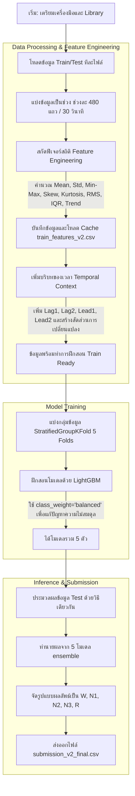

# 🌙 Sleep Stage Classification: Machine Learning Guide

บทความนี้สรุปขั้นตอนและกระบวนการทำงานทั้งหมดที่อยู่ในไฟล์ `sleep_signal.ipynb` เพื่อใช้ในการสกัดลักษณะเฉพาะประจำกระแสสัญญาณ (Feature Engineering) และทำการฝึกสอน (Training) โมเดลในการจำแนกความลึกของการนอนหลับจากแฟ้มข้อมูลสัญญาณต่างๆ

---

## 📊 Flow Chart แผนภาพรวมการทำงาน (Pipeline)

---

## 📝 สรุปแต่ละขั้นตอนอย่างละเอียด

### 0. เตรียมเครื่องมือ (Setup)
เริ่มต้นด้วยการนำเข้า Library ที่จำเป็น ได้แก่ `pandas`, `numpy`, `lightgbm`, `scipy.stats` (ใช้หา skewness, kurtosis), `sklearn` (สำหรับการแบ่ง K-Fold), และ `tqdm` สำหรับแสดงความคืบหน้าการประมวลผล

### 1. สกัดฟีเจอร์ (Feature Engineering V2)
นำเข้าข้อมูลสัญญาดิบที่แบ่งเป็นรอบละ 30 วินาที (480 บรรทัด) แล้วแปลงสภาพให้กลายเป็นค่าสรุปทางตัวเลขสถิติ โดยใช้ตัวแปรทั้งหมด (BVP, ACC, TEMP, EDA, HR, IBI) และคำนวณ:
*   ขนาดแรงเสียดทาน (ACC Magnitude) รวมจากแกน X, Y, Z
*   **ค่าสถิติพื้นฐาน**: ค่าเฉลี่ย (Mean), ส่วนเบี่ยงเบนมาตรฐาน (Std), ค่าต่ำสุด (Min), ค่าสูงสุด (Max), มัธยฐาน (Median), ความเบี้ยว (Skew), ความโด่ง (Kurt) และพลังงานทางสัญญาณ (RMS)
*   **การกระจายตัว**: ควอร์ไทล์ที่ 25 (Q25), 75 (Q75) ช่วงพิกัดสูงสุดต่ำสุด (Range), รวมไปถึง IQR
*   **เจาะลึกครึ่งรอบ (Trend)**: หั่น 30 วินาทีออกเป็น 2 ส่วน (H1/H2) แล้วดูการเปลี่ยนแปลง (Trend) ค่าเฉลี่ยในระหว่างช่วงเวลา

### 2. การโหลดข้อมูลและทำ Cache
เนื่องจากการประมวลผล Feature Engineering กับไฟล์ทั้งหมดใช้เวลานาน จึงมีการสร้างกระบวนการเก็บไฟล์ Cache `train_features_v2.csv` เพื่อให้การรันโค้ดรอบต่อไปทำได้ทันทีโดยไม่ต้องไป Loop สร้าง Feature จากไฟล์ใหม่

### 3. บริบทของเวลา (Temporal Context)
สเตจของการนอนหลับมักมีพฤติกรรมต่อเนื่องติดกัน จึงมีการใช้คำสั่ง `.shift()` เพื่อเข้าถึงค่า Feature ช่วงเวลาก่อนหน้า (Lag1, Lag2) และถัดไป (Lead1, Lead2) แล้วนำมาลบกันหา `Derivative/Difference` วัดความเร็วการเปลี่ยนแปลงของสัญญาณในแต่ละวินาที เพื่อให้โมเดลทราบถึงบริบทการเปลี่ยนสภาวะ

### 4. ฝึกสอนโมเดล (Training)
*   ใช้โมเดลประเภท Gradient Boosting อย่าง **LightGBM** (`lgb.LGBMClassifier`) ที่โดดเด่นกับข้อมูลที่เป็นเชิงตาราง
*   ตั้งค่าตัวแปร `class_weight='balanced'` เพื่อบังคับให้โมเดลสนใจ Class ที่หายากๆ เช่น N1 (Stage 1) ให้มากขึ้น จะได้ไม่ไปมุ่งเดาแค่ Class เด่นๆ อย่างเดียว
*   ใช้ `StratifiedGroupKFold` แบ่งข้อมูลเป็น 5 Folds เพื่อการประเมินประสิทธิภาพที่เข้มข้นที่สุดและการวัดผลที่สมจริงขึ้น

### 5. ทำนายชุดคำตอบ (Test Inference)
อ่านไฟล์จากโฟลเดอร์สำหรับส่งขึ้น Kaggle และเอาผ่านกระบวนการทำ Feature และ Temporal แบบเป๊ะๆ ซึ่งต้องรักษาข้อมูลกลุ่มและโฟลเดอร์ให้ถูกต้อง

### 6. สร้างไฟล์ส่งคำตอบ (Submission)
ในการคาดเดา ใช้โมเดล LightGBM ทั้ง 5 ตัวมาร่วมโหวตความน่าจะเป็น (Soft Voting / Probabilities Averaging) โมเดลจะนำผลลัพธ์มาพิจารณาเปรียบเทียบกับ Index ของไฟล์ `sample_submission.csv` แล้วสร้างไฟล์ชิ้นสมบูรณ์ชื่อ **`submission_v2_final.csv`** นำไปอัปโหลดเข้าแข่งขันได้จริง!
