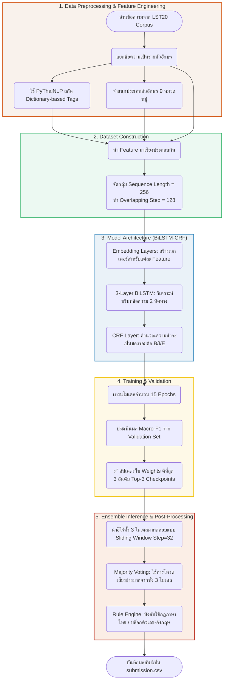

# LST20 Thai Word Segmentation Pipeline

สรุปขั้นตอนการประมวลผลและการสร้างโมเดลตัดคำภาษาไทยแบบ End-to-End จากโค้ดในไฟล์ `word_segmentation.ipynb`

## 📌 Flowchart ภาพรวมของระบบ (System Architecture)

## 📝 สรุปภาพรวมและขั้นตอนการทำงานแบบละเอียด (Step-by-Step Overview)

ต่อไปนี้คือรายละเอียดของเทคนิคที่ถูกเขียนไว้ในไฟล์ `word_segmentation.ipynb` เพื่อใช้แก้โจทย์ปัญหาตัดคำภาษาไทย (LST20) นี้

### 1. การสกัดและการเตรียมฟีเจอร์ข้อมูล (Feature Engineering)
โมเดลไม่ได้เรียนรู้จากตัวอักษรเปล่า ๆ เท่านั้น แต่ขับเคลื่อนการเรียนรู้ด้วย 3 ตัวแปร (Features) พร้อมกันดังนี้:
- **ตัวอักษรตั้งต้น (Character ID):** รหัสของแต่ละตัวอักษร
- **การจัดหมวดหมู่ตัวอักษร (Character Type):** ฟังก์ชันจำแนกตัวอักษรออกเป็น 9 ประเภทช่วยโมเดลให้รู้หน้าที่ของมัน เช่น พยัญชนะ, สระ, วรรณยุกต์, ตัวอักษรโรมัน (อังกฤษ), ตัวหนังสือตัวเลข ฯลฯ
- **พจนานุกรมปูพื้น (Dictionary-based Target):** มีการหยิบไลบรารีดั้งเดิมอย่าง `pythainlp` (ใช้ engine `newmm`) มาช่วยตัดคำหาแท็กก่อนอย่างคร่าวๆ เพื่อให้ได้ใบ้ว่าตำแหน่งไหนเป็นแท็ก `B`, `I` ให้กับโมเดลแบบไม่ต้องเดาตั้งต้นจากศูนย์ 

### 2. โครงสร้างชุดข้อมูลฝึกสอน (Dataset Construction)
- ข้อมูล Text ตัวอักษรจะถูกแบ่งใส่เป็นช่องขนาด **ยาว 256 ตัวอักษรຕໍ່ 1 Sequence Box**
- **แก้ปัญหารอยต่อข้อความไม่เชื่อมกัน:** ในขณะ Training Data Loader จะมีการทำ Overlapping กล่องข้อมูล (กำหนดให้เลื่อนแกนอ่านข้อมูลเหลื่อมกันทีละ `Step=128` ตัวอักษร) 

### 3. โครงสร้างทางสถาปัตยกรรม Deep Learning (BiLSTM-CRF)
โมเดลนี้สร้างโดย PyTorch อาศัยเทคนิคยอดฮิตของ Token Classification มีชั้นเลเยอร์การทำงานคือ
- **Embeddings Layer:** แปลงค่าตัวเลขธรรมดาจาก Feature ทั้ง 3 ประเภทเป็น Vectors ก้อนแล้วหลอมรวมเข้าด้วยกัน
- **BiLSTM (Bidirectional LSTM):** ใช้โครงข่ายประสาทลึกถึง 3 ก้อนทำงานซ้อนกัน (มีจำนวน Neuron หลักถึง 256 เส้น) ที่ช่วยจำเอาประโยคที่อยู่ข้างหน้าตัวอักษรมาเทียบกับข้างหลัง และหลังเทียบหน้า 
- **CRF (Conditional Random Fields):** เพิ่มระบบเงื่อนไขประเมินสถิติ ว่าหากมี Tag `B` ออกมา ตัวถัดไปจะมีโอกาสตามมาด้วย Tag สไตล์ไหนได้บาง เพื่อจัดระเบียบตรรกะผลลัพธ์ (`B_WORD`, `I_WORD` หรือ `E_WORD`)

### 4. กระบวนการเทรนนิ่ง และคลังสมองโมเดลชั้นยอด (Training & Ensembling Strategy)
- ให้โมเดลทำงานและปรับปรุงตัวเอง 15 รอบการเรียนรู้ (Epochs) ด้วยกลไก `Adam Optimizer` ที่ช่วยปรับลดค่าน้ำหนัก Learning Rate ลงเมื่อเวลาผ่านไป
- ⭐️ **การออกแบบ Top-K Checkpoints:** ขณะทำงาน จะคอยบันทึก F1 Score โดยจะจดจำและ **เก็บค่าน้ำหนัก (Weights) ของโมเดลที่มีประสิทธิภาพสูงสุด 3 อันดับแรกเท่านั้น** เพื่อความรวดเร็วและใช้ในการ Ensemble ไม่ต้องพึ่งพาแค่รอบทดสอบสุดท้ายใดรอบหนึ่งเพียงจุดเดียว

### 5. การทดสอบสุดประณีต การลงคะแนน และจัดการประโยคด้วย Rules
เมื่อสั่งให้ทำสอบผลลัพธ์ในกลุ่ม Test Set เราดึงศักยภาพมันออกมาดังนี้:
- **High-Resolution Overlapping Inference:** ซอยกล่องการเลื่อนทดสอบให้แคบ (Step ถอยลงมาเหลือเพียงแค่ `32` สเตป) เพื่อให้รอยต่อถูกซ้อนทับกันหลายรอบ
- **Majority Voting (ดึง 3 โมเดลมาสอบพร้อมกัน):** นำโมเดล 3 ตัวที่เป็นแชมป์จากการเทรน มาโหวตคำตอบร่วมแบบประชาธิปไตย แท็กใดได้รับการยอมรับจาก 3 ระบบเยอะที่สุด ก็ชนะไปเลย
- **Post-Processing Rules Engine:** อุดรอยรั่วความไม่เป็นธรรมชาติด้วยการบังคับกฎ เช่น
  - **สระหรือวรรณยุกต์ปะติด:** ห้ามขึ้นหัวประโยคใหม่ (B) หากเป็นไม้หันอากาศ ไม้โท หรือสระบนล่างใดๆ ให้แก้ไปเป็น (I) 
  - **ตัวเลขและข้อความภาษาอังกฤษ:** หากต่อเนื่องกันโมเดลจะต้องไม่ตัดคำ (เช่น 1999, Happy ไม่ให้หุบเข้าขบวนเป็นแท็ก B แต่รักษาความเป็น I แทน)

### 6. ยืนยันการส่งออกข้อมูล (Export Submission)
เสร็จสรรพ นำ Tag ที่ชนะและผ่านกฏภาษาแล้วมาเข้า Mapping ย้อนกลับใส่เข้าไฟล์ `submission.csv` เพื่อเข้าคะแนนผลลัพธ์ต่อไป
