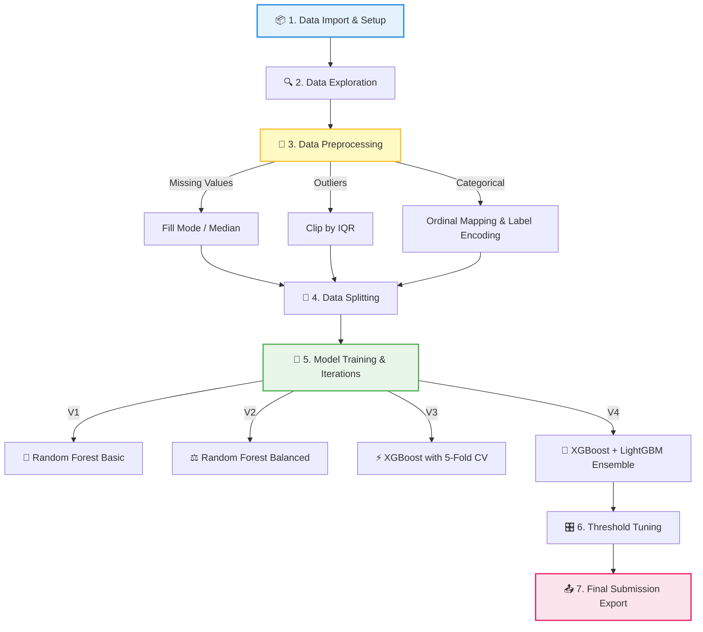

# 🫀 Heart Disease Prediction - Hackathon Workflow 🚀

ยินดีต้อนรับสู่โปรเจ็กต์การทำนายโรคหัวใจ! ไฟล์ README นี้ถูกสร้างขึ้นเพื่อสรุปกระบวนการทำงานและขั้นตอนทั้งหมดที่อยู่ในไฟล์ `heart_desease_prediction.ipynb` อย่างละเอียด เพื่อให้เห็นภาพลวมของ Workflow ตั้งแต่การเตรียมข้อมูลไปจนถึงการทำโมเดล Ensemble

---

## 📌 ภาพรวมของโปรเจ็กต์ (Project Overview)
**เป้าหมายหลัก:** ทำนายประวัติการป่วยเป็นโรคหัวใจ (Yes / No) ของผู้ป่วยแต่ละคนโดยอ้างอิงจากข้อมูลด้านสุขภาพ เช่น BMI, ความดันโลหิต, รายได้, และระดับการศึกษา 
**เงื่อนไข:** ใช้เฉพาะข้อมูลที่กำหนดให้ (ห้ามใช้ Pre-trained Model จากภายนอก)

---

## 🗺️ แผนภาพขั้นตอนการทำงาน (Workflow Flowchart)

---

## 📋 รายละเอียดของแต่ละขั้นตอน (Step-by-Step Breakdown)

### 📦 1. นำเข้าไลบรารีและตั้งค่า (Import & Setup)
- ทำการติดตั้งและอิมพอร์ตไลบรารีที่จำเป็นสำหรับ Data Science และ Machine Learning เช่น `pandas`, `numpy`, `matplotlib`, `xgboost`, และ `lightgbm`

### 🔍 2. โหลดและสำรวจข้อมูล (Data Investigation)
- โหลดข้อมูลจาก `train.csv` (มีคำตอบ) และ `test.csv` (ต้องทำนาย)
- ตรวจสอบคอลัมน์ที่มีค่าว่าง (Missing values) เพื่อวิเคราะห์ปัญหาเบื้องต้นในชุดข้อมูล

### 🧹 3. การเตรียมข้อมูล (Data Preprocessing & Feature Engineering)
เป็นหัวใจสำคัญของการทำให้ผลลัพธ์แม่นยำ ประกอบด้วย:
1. **การจัดการค่าว่าง (Missing Values):** 
   - ข้อมูลตัวอักษร (Categorical): เติมด้วยค่าที่พบมากที่สุด (Mode)
   - ข้อมูลตัวเลข (Numerical): เติมด้วยค่ามัธยฐาน (Median)
2. **การกำจัด Outliers:** จัดการความผิดปกติในคอลัมน์ตัวเลข (เช่น *Body Mass Index*) ด้วยวิธีดึงค่าที่หลุดกรอบมากๆ ให้กลับมาอยู่ในขอบเขตด้วยวิธี IQR (Interquartile Range)
3. **การแปลงข้อความแบบมีลำดับ (Ordinal Mapping):** แปลงข้อมูลเชิงคุณภาพที่มีระดับชั้น เช่น สุขภาพ (Poor -> Excellent), การศึกษา, รายได้ ให้เป็นตัวเลขตามลำดับชั้นอย่างสมเหตุสมผล
4. **Label Encoding:** แปลงข้อความที่เหลือ (เช่น Yes/No, Male/Female) ให้เป็นตัวเลข (0, 1) เตรียมพร้อมเข้าสู่โมเดล

### 🔀 4. แบ่งข้อมูลเพื่อการเรียนรู้ (Data Splitting)
- แยกข้อมูลออกเป็นชุด Features (ตัวแปรฟีเจอร์) และ Target (คำตอบ `History of HeartDisease or Attack`)
- แบ่งข้อมููล `train` ส่วนหนึ่งออกมาเป็น `Validation Set` (80:20) เอาไว้จำลองสนามสอบให้โมเดล

### 🤖 5. การสร้างและพัฒนาโมเดล (Model Training Iteration)
กระบวนการเทรนมีการพัฒนาโมเดลยกระดับขึ้นไปทีละขั้น ดังนี้:

* **V1: Basic Random Forest** - โมเดลแบบพื้นฐานเพื่อดู Accuracy เบื้องต้น
* **V2: Balanced Random Forest** - เพิ่มพารามิเตอร์ `class_weight='balanced'` เพื่อแก้ไขปัญหา Class Imbalance (คนเป็นโรคหัวใจมีน้อยกว่าคนไม่เป็นมาก) ดันค่า Recall ให้สูงขึ้น
* **V3: XGBoost + 5-Fold Cross Validation** - 
  - สลับใช้ `StratifiedKFold` แบ่งข้อมูล 5 สัดส่วน ฝึกและสอบสลับกัน ป้องกันปัญหาคะแนนตก (Overfitting) ตอนส่งจริง
  - ปรับจูนน้ำหนัก Class จัดเต็มด้วยอัลกอริทึม XGBoost 
* **V4: The Ensemble (XGBoost + LightGBM)** 🌟 *(โมเดลสมบูรณ์แบบที่สุด)*
  - สร้างโมเดลขั้นสูงทั้ง XGBoost และ LightGBM
  - นำผลความมั่นใจ (Probability) จากทั้ง 2 โมเดลมาหาค่าเฉลี่ยแบบ **Ensemble** ช่วยลดความเอนเอียงและแม่นยำเสถียรที่สุด

### 🎛️ 6. การปรับจูน Threshold (Threshold Tuning)
- แทนที่จะตัดสินว่าเกิน 50% เป็นโรคหัวใจ โมเดลทำการวนลูปทดสอบค่า **Threshold** ตั้งแต่ 0.30 ถึง 0.70 บน Validation Set เพื่อหาจุดตัดที่จะทำให้ได้ค่าคะแนน **F1-Score** มอบผลลัพธ์สูงสุด (ได้ค่าที่ดีที่สุดคือประมาน `0.69`)

### 📤 7. ส่งออกผลลัพธ์ (Export Submission)
- นำชุดข้อมูลที่ทำนายได้จากโมเดลที่ดีที่สุด มาทำตารางในโครงสร้าง Kaggle Format
- แปลงกลับจาก 0 และ 1 เป็น `No` และ `Yes` 
- บันทึกยื่นเป็นไฟล์ CSV ล่าสุด (`my_submission_v4_ensemble.csv`) นำส่งเข้าระบบ Kaggle เป็นอันเสร็จสิ้นภารกิจ! 🎉
