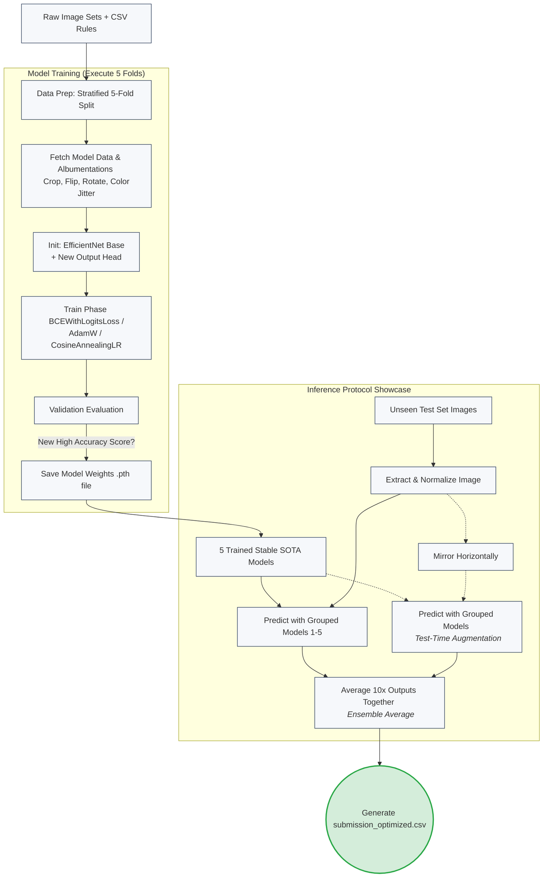

# House Recognition Pipeline 🏠

โปรเจกต์นี้เป็นการพัฒนาระบบ AI เพื่อจำแนกประเภทของบ้าน (House Recognition) จากไฟล์ `house-recognition.ipynb` ที่มุ่งเน้นประสิทธิภาพความแม่นยำสูง (SOTA: State-of-the-Art)

---

## สรุปเทคนิคที่ใช้และเหตุผล (Why we chose these methods)

โปรเจกต์กระบวนการเทรนและดึงความสามารถของโมเดลออกมาให้ถึงขีดสุด โดยเราได้เลือกเทคนิคต่างๆ ดังนี้:

1. **Transfer Learning ด้วย EfficientNet (`timm`)**
   - **ทำไมถึงใช้?** การเริ่มเทรนภาพโดยเริ่มจากศูนย์จะใช้เวลานานและอาจได้ผลไม่ดีนัก เราเลือกใช้โครงสร้างอย่าง EfficientNet ที่ถูก pre-train กับภาพนับล้านมาแล้ว (ImageNet) ทำให้ตัวแปรรับรู้ลักษณะ "เส้น ขอบ มุมและพื้นผิว" พื้นฐานได้ดีมาก เราจึงเพียงแค่เปลี่ยนส่วนปลาย หรือ Classification Head เพื่อจำแนกแค่คลาสเป้าหมายของเรา (Binary Classification)

2. **Data Augmentation ขั้นสุดด้วย `albumentations`**
   - **ทำไมถึงใช้?** เพื่อป้องกันอาการโมเดลจำข้อสอบยอดฮิต (Overfitting) โมเดลที่ดีควรรับมือกับมุมมองสภาพแสงที่เพี้ยนได้ เราจึงดัดแปลงภาพก่อนส่งสอนโมเดลตลอด เช่น สุ่มครอบตัด (RandomResizedCrop), พลิกซ้ายขวา (HorizontalFlip), ขยับและหมุนภาพ (ShiftScaleRotate), หรือปรับแสงและสีให้มืด/สว่างขึ้น (ColorJitter) 

3. **5-Fold Stratified Cross Validation**
   - **ทำไมถึงใช้?** แทนที่จะแบ่งส่วนสอนกับส่วนลองทดสอบแค่แบบสุ่มผ่านๆ เราเลือกแบ่งข้อมูลเป็น 5 ส่วน และบังคับให้แต่ละส่วนรักษาสัดส่วนของคลาส 0 กับ 1 ให้เท่าเทียมกันที่สุด เพื่อหาค่าประเมินความแม่นยำจากทั้ง 5 กลุ่ม ขจัดความลำเอียง และได้โมเดลที่เสถียรสุดยอด 5 ตัว

4. **Ensemble Modeling และ Test-Time Augmentation (TTA)**
   - **ทำไมถึงใช้?** ในการเอาไปใช้งานจริง (Inference) เราไม่ได้เชื่อโมเดลตัวเดียว แต่เราเรียกใช้โมเดลสุดยอดทั้ง 5 โฟลด์ มาประมวลผลโหวตคำตอบร่วมกัน (Ensemble) ยิ่งไปกว่านั้น ก่อนทำนายเราได้ป้อนภาพปกติ 1 ภาพ แถมด้วยภาพสะท้อน (พลิกซ้าย-ขวา) เข้าไปทำนายด้วย (TTA) เพื่อการันตีว่าโมเดลให้คำตอบที่มีความมั่นใจและแม่นยำมากที่สุด

---

## อธิบายเป็นขั้นตอน (Step-by-Step Workflow)

1. **การตั้งค่า Configuration:**
   - เตรียมตัวแปรหลักทั้งหมดที่เดียว เช่น ขนาดภาพ 260x260, จำนวน Epoch=7, Batch Size=32 รวมไปถึงการล็อกคีย์ `seed_everything` เพื่อให้รันกี่ครั้งก็ได้ผลเหมือนเดิม

2. **การเตรียมข้อมูล (Stratified K-Fold Split):**
   - ดึงรายชื่อภาพจากไฟล์ CSV 
   - อัปเดตผูก Path ของภาพเข้าในโฟลเดอร์ และสับไพ่ข้อมูลออกเป็น 5 โฟลด์ (คอลัมน์ชื่อ Fold: 0 ถึง 4)

3. **Dataset & Image Transforms:**
   - ใช้งานคลาส `HouseDataset` ของ Dataset เพื่ออ่านภาพด้วย OpenCV
   - ภาพต่างๆ จะถูกแปลงตามเงื่อนไข Augmentation ถ้าเป็นการเทรน ก็จะโดนปรับให้เลอะและสุ่มต่างๆ ถ้าประเมินจะแค่ปรับอัตราส่วนเท่านั้น

4. **สถาปัตยกรรมโมเดล (Model Architecture):**
   - โหลดโมเดลอย่าง `tf_efficientnet_b2.ns_jft_in1k` และตัดหัวของโมเดลเก่าทิ้ง
   - ติดตั้งหัว Classifier ใหม่ เพื่อคำนวณและลดทอนการ Overfit ด้วยการเพิ่ม Dropout (0.2) และจบด้วย Dense Layer 1 ขาออก

5. **Train Process (ทีละ Fold):**
   - ฟังก์ชันจะลูป 5 รอบ (ในแต่ละโฟลด์) 
   - เครื่องมือขุดหาความแม่นยำจะใช้ Loss Function แบบ `BCEWithLogitsLoss` จับคู่ Optimizer ยอดนิยม `AdamW` 
   - ควบคุมการเรียนรู้ (Learning Rate) ให้ค่อยๆ เบาลงคล้ายภูเขาหน้าโค้ง (CosineAnnealingLR) เพื่อการร่อนลงรันเวย์แบบสมูทสุด
   - หาก Accuracy ในการประเมินรอบไหนสูงที่สุด จะ Save น้ำหนักโมเดล (`.pth`) ตัวนั้นไว้ 

6. **Inference (การทำนายในชุด Test Set):**
   - นำไฟล์ CSV ทดสอบมาโหลดภาพ
   - ยิงคำสั่งใช้พลังจากโมเดลทั้ง 5 ตัว มารับภาพปกติ กับภาพพลิกซ้ายขวา รวมกันหารเฉลี่ยเพื่อให้ได้คำตอบที่นิ่งและเนียนที่สุด
   - เคาะค่าความน่าจะเป็น > 0.5 ให้เป็นเลขระดับ Integer คลาส 0 และ 1
   - แพ็กสรุปและบันทึกลงไฟล์ `submission_optimized.csv` 

---

## Flow Chart ภาพรวมการทำงาน

